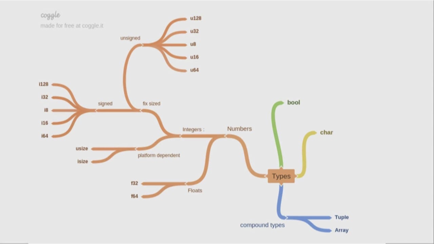

# Tipos de Datos Escalares en Rust

Los tipos de datos escalares en Rust representan un valor individual. Rust tiene cuatro tipos escalares principales:

## 1. Enteros

Los enteros son números sin componente fraccionario. Rust proporciona varios tipos de enteros con y sin signo:

| Tipo    | Tamaño   | Rango                                                    |
|---------|----------|---------------------------------------------------------|
| `i8`    | 8 bits   | -128 a 127                                               |
| `u8`    | 8 bits   | 0 a 255                                                  |
| `i16`   | 16 bits  | -32,768 a 32,767                                         |
| `u16`   | 16 bits  | 0 a 65,535                                               |
| `i32`   | 32 bits  | -2,147,483,648 a 2,147,483,647                           |
| `u32`   | 32 bits  | 0 a 4,294,967,295                                        |
| `i64`   | 64 bits  | -9,223,372,036,854,775,808 a 9,223,372,036,854,775,807  |
| `u64`   | 64 bits  | 0 a 18,446,744,073,709,551,615                           |
| `i128`  | 128 bits | -(2^127) a 2^127 - 1                                     |
| `u128`  | 128 bits | 0 a 2^128 - 1                                            |
| `isize` | arch     | Depende de la arquitectura (32 o 64 bits)                |
| `usize` | arch     | Depende de la arquitectura (32 o 64 bits)                |

### Ejemplos:

```rust
let a: i32 = 42;
let b: u8 = 255;
let c = 98_222;  // Rust permite usar _ como separador para mejorar la legibilidad
let d = 0xff;    // Hexadecimal
let e = 0o77;    // Octal
let f = 0b1111_0000;  // Binario
```

## 2. Punto Flotante

Rust tiene dos tipos de punto flotante: `f32` y `f64` (32 y 64 bits respectivamente).

### Ejemplos:

```rust
let x = 2.0; // f64 por defecto
let y: f32 = 3.0; // f32 explícito
```

## 3. Booleanos

El tipo booleano en Rust se representa con `bool` y puede tener dos valores: `true` o `false`.

### Ejemplos:

```rust
let t = true;
let f: bool = false;
```

## 4. Caracteres

El tipo `char` en Rust representa un valor escalar Unicode, lo que significa que puede representar mucho más que solo ASCII.

### Ejemplos:

```rust
let c = 'z';
let z: char = 'ℤ';
let heart_eyed_cat = '😻';
```

## Operaciones y Conversiones

### Operaciones Aritméticas

```rust
fn main() {
    // Enteros
    let suma = 5 + 10;
    let diferencia = 95.5 - 4.3;
    let producto = 4 * 30;
    let cociente = 56.7 / 32.2;
    let residuo = 43 % 5;

    // Punto flotante
    let suma_float = 5.0 + 10.0;

    println!("Suma: {}", suma);
    println!("Diferencia: {}", diferencia);
    println!("Producto: {}", producto);
    println!("Cociente: {}", cociente);
    println!("Residuo: {}", residuo);
    println!("Suma float: {}", suma_float);
}
```

### Conversiones

Rust requiere conversiones explícitas entre tipos numéricos:

```rust
let x = 5;
let y = 6.4;

let z = x as f64 + y;

println!("z: {}", z);
```

## Inferencia de Tipos

Rust puede inferir tipos en muchos casos:

```rust
let x = 5; // Rust infiere que x es i32
let y = 2.0; // Rust infiere que y es f64
```

## Consideraciones Importantes

1. **Desbordamiento**: En modo de depuración, Rust verifica el desbordamiento de enteros y causa pánico si ocurre. En modo de lanzamiento, ocurre un "wrap around".

2. **NaN**: Para operaciones de punto flotante que no producen un número real (como 0.0 / 0.0), el resultado es NaN (Not a Number).

3. **Precisión**: Los tipos de punto flotante pueden tener problemas de precisión en ciertas operaciones debido a su naturaleza de representación binaria.

4. **Tamaño en Memoria**: `isize` y `usize` dependen de la arquitectura del sistema (32 bits en sistemas de 32 bits, 64 bits en sistemas de 64 bits).

5. **Literales Numéricos**: Puedes especificar el tipo de un literal numérico añadiendo el tipo como sufijo, por ejemplo, `57u8` es un `u8`.

Los tipos de datos escalares en Rust proporcionan una base sólida para trabajar con valores individuales, ofreciendo un equilibrio entre precisión, rendimiento y seguridad de tipos. La elección adecuada del tipo escalar puede tener un impacto significativo en la eficiencia y corrección de tu programa.
