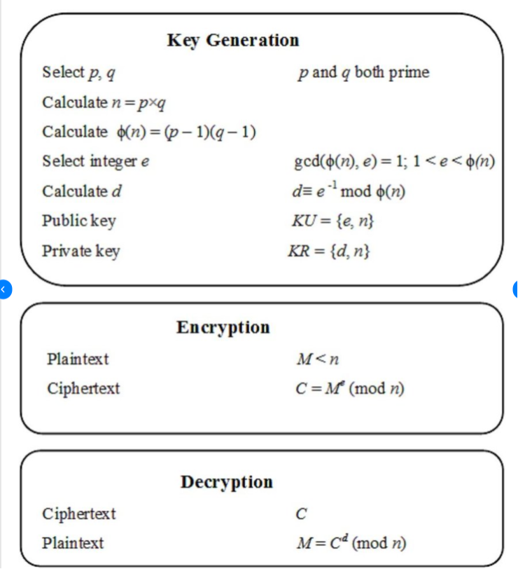

# BigInt en Rust

BigInt se usa principalmente para:
1.	Cálculos de precisión arbitraria: Cuando se necesitan números enteros más grandes que los que pueden manejar los tipos integrados.
2.	Criptografía: Muchos algoritmos criptográficos requieren operaciones con números extremadamente grandes.
3.	Cálculos financieros: Para evitar errores de redondeo en cálculos monetarios precisos.
4.	Matemáticas teóricas: En problemas que involucran números muy grandes, como en teoría de números.
Características
5.	Tamaño dinámico: Puede crecer según sea necesario para acomodar números de cualquier tamaño.
6.	Precisión exacta: No hay pérdida de precisión como puede ocurrir con tipos de punto flotante.
7.	Operaciones aritméticas: Soporta todas las operaciones aritméticas básicas.

Ejemplo del algoritmo RSA
!

   
1. [Codigo in playground](https://play.rust-lang.org/?version=stable&mode=debug&edition=2021&gist=e0e49d3db2194bf296fa7e74bb2980eb)
```rust
fn main() {
    use num_bigint::BigInt;
    // This section performs RSA encryption and decryption using BigInt for large integers.
    let p = BigInt::from(1489); // First prime number
    let q = BigInt::from(1493); // Second prime number
    let n = &p * &q; // Calculate n as the product of p and q
    let phi = (&p - 1) * (&q - 1); // Calculate phi(n) = (p-1)(q-1)
    println!("n {} phi {}", n, phi); // Output n and phi

    let e = BigInt::from(13); // Public exponent
    let d = e.modinv(&phi).unwrap(); // Calculate private exponent d using modular inverse
    println!("e {} {} d {} {}", e, n, d, n); // Output e, n, and d

    let m = BigInt::from(8889); // Message to be encrypted
    let c = m.modpow(&e, &n); // Encrypt the message using c = m^e mod n
    println!("c {}", c); // Output the ciphertext

    let m2 = c.modpow(&d, &n); // Decrypt the ciphertext using m2 = c^d mod n
    println!("original {} m2 {}", m, m2); // Output the original message and }
}
    ```
   
   

    